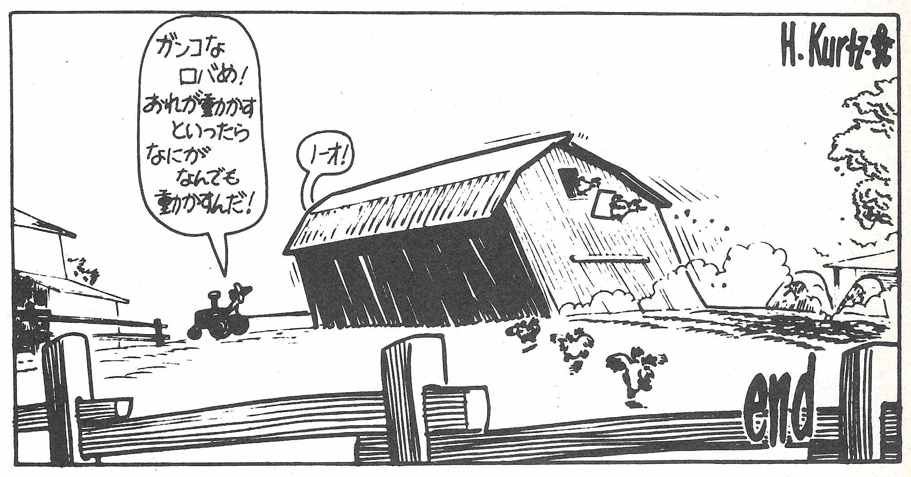
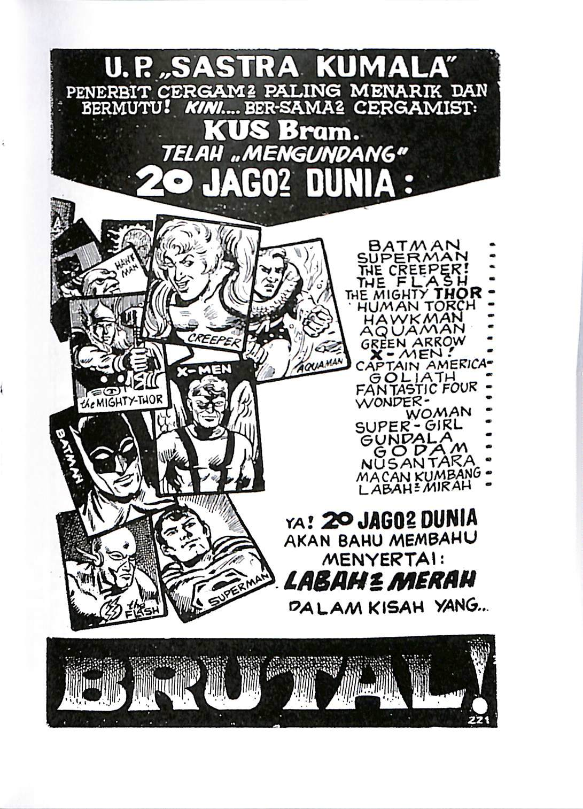
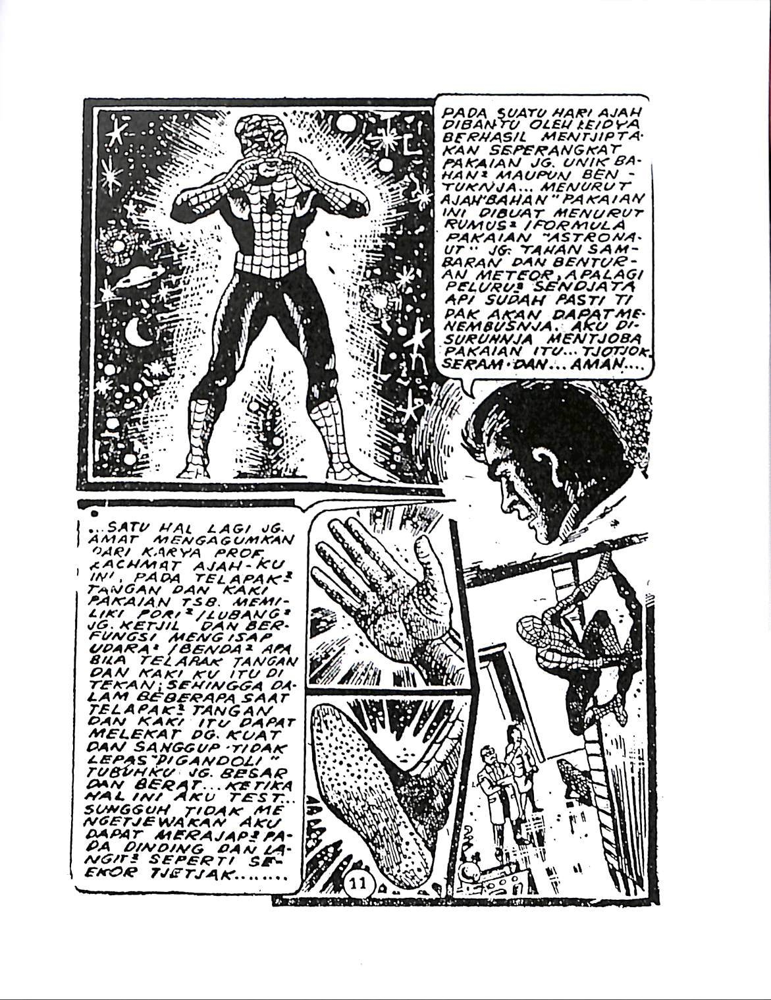
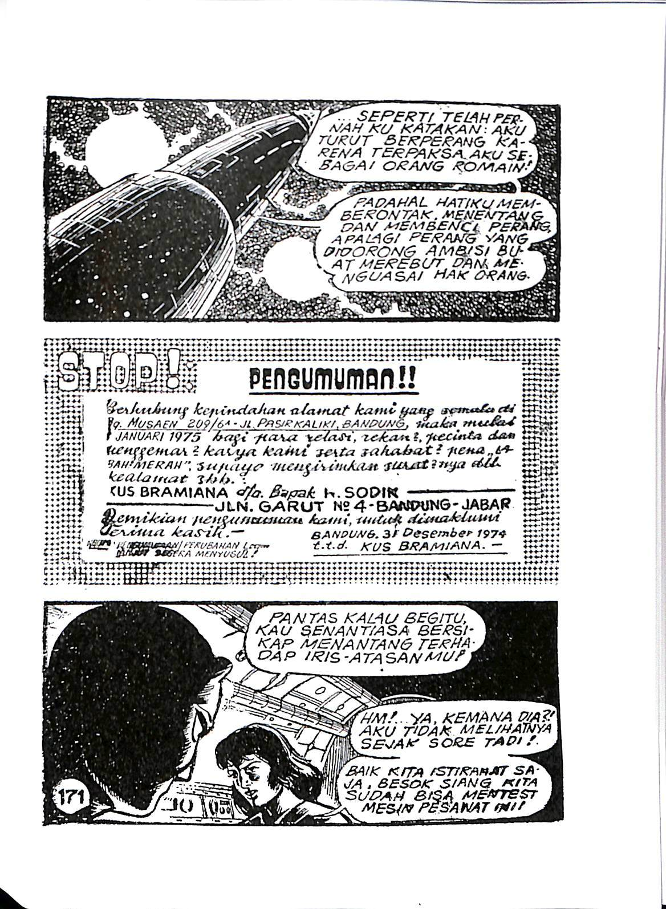

# cloud-comics-translation

 Translation experiments using React, GraphQL, and cloud ML.

<h2 align="left">Document Samples</h2>

<h2 align="left">Tech Demos</h2>

| Date | Title | Software 
| ------ | ----------- | --------
| Aug 20, 2020   | [Better OCR for Newspapers](https://medium.com/@blacksmithforlife/better-ocr-for-newspapers-c7c1e2788b7a) | OpenCV, Tesseract
| Aug 3, 2020   | [Reading and Categorizing Scanned Documents using Deep Learning](https://medium.com/@shairozsohail/reading-and-categorizing-scanned-documents-using-deep-learning-4ab2c0e3f34c) | Microsoft Computer Vision API
| Jul 31, 2020   | [Amazon Augmented AI (Amazon A2I) integration with Amazon Textract's Analyze Document](https://github.com/aws-samples/amazon-a2i-sample-jupyter-notebooks/blob/master/Amazon%20Augmented%20AI%20(A2I)%20and%20Textract%20AnalyzeDocument.ipynb) | Amazon A2I, Textract
| Dec 15, 2019   | [Real Time OCR Web App (React, NodeJS, Python and AWS)](https://www.youtube.com/watch?v=ZXvdCZTRbP4&t=193s) | AWS Textract
| June 2019   | [I used ML to find public domain Krazy Kat comics in newspaper archives](https://joel.franusic.com/krazy_kat/about/) | Microsoft Custom Vision
| Mar 10, 2019   | [Create a Highly Scalable Image Processing Service on AWS Lambda and API Gateway in 10 Minutes](https://medium.com/@shairozsohail/reading-and-categorizing-scanned-documents-using-deep-learning-4ab2c0e3f34c) | OpenCV, AWS Lambda

